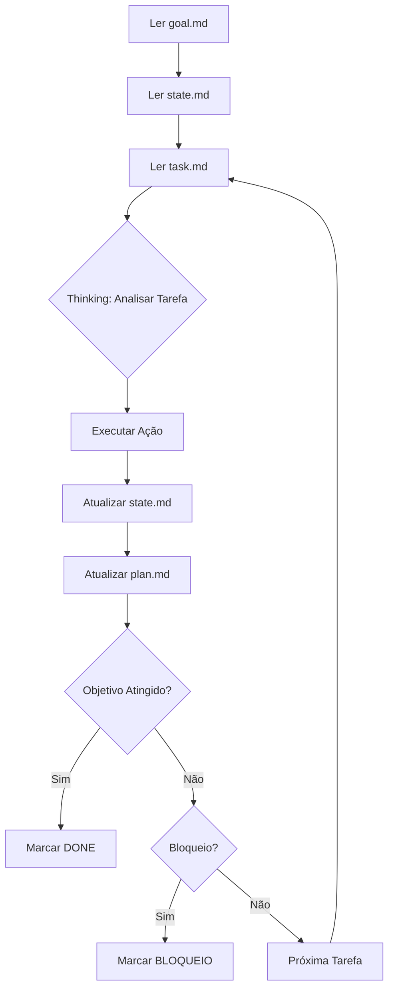

# Guia Completo: Stack de Desenvolvimento Bruno (WSL + Cursor + GLM-4.7)

## Índice
1. [Pré-requisitos](#1-pré-requisitos)
2. [Instalação do Ambiente Base](#2-instalação-do-ambiente-base)
3. [Configuração do Cursor](#3-configuração-do-cursor)
4. [Estrutura do Agente Autônomo](#4-estrutura-do-agente-autônomo)
5. [Protocolo de Operação](#5-protocolo-de-operação)
6. [Workflow de Uso](#6-workflow-de-uso)
7. [Otimizações e Boas Práticas](#7-otimizações-e-boas-práticas)
8. [Troubleshooting](#8-troubleshooting)

---

## 1. Pré-requisitos

### 1.1 Sistema Operacional
- **Windows 10/11** com WSL2 habilitado
- **Ubuntu 22.04 LTS** no WSL2 (recomendado)

### 1.2 Verificar WSL2
```bash
# No PowerShell (Admin):
wsl --list --verbose

# Se não estiver instalado:
wsl --install
wsl --set-default-version 2
```

### 1.3 Software Necessário
- **Cursor** (editor baseado em VS Code)
- **Git** instalado no WSL
- **Node.js** (se aplicável ao projeto)

---

## 2. Instalação do Ambiente Base

### 2.1 Atualizar Ubuntu no WSL
```bash
sudo apt update && sudo apt upgrade -y
```

### 2.2 Instalar Dependências Essenciais
```bash
sudo apt install -y \
  build-essential \
  git \
  curl \
  wget \
  vim \
  tree \
  jq
```

### 2.3 Configurar Diretório de Trabalho
```bash
# IMPORTANTE: Use o sistema de arquivos do Linux
cd ~
mkdir -p ~/projects
cd ~/projects

# NÃO use /mnt/c/ para projetos ativos (performance)
```

### 2.4 Configurar Git
```bash
git config --global user.name "Seu Nome"
git config --global user.email "seu@email.com"
git config --global init.defaultBranch main
```

---

## 3. Configuração do Cursor

### 3.1 Instalação
1. Baixe o Cursor em: https://cursor.sh
2. Instale normalmente no Windows
3. Abra o Cursor e configure o WSL

### 3.2 Conectar ao WSL
```bash
# No Cursor, pressione Ctrl+Shift+P
# Digite: "WSL: Connect to WSL"
# Selecione sua distro Ubuntu
```

### 3.3 Configurar Terminal Integrado
```json
// Cursor Settings (Ctrl+,) → JSON
{
  "terminal.integrated.defaultProfile.windows": "WSL",
  "terminal.integrated.profiles.windows": {
    "WSL": {
      "path": "wsl.exe"
    }
  }
}
```

### 3.4 Configurar Modelo GLM-4.7
1. Abra as configurações de IA do Cursor
2. Adicione o modelo GLM-4.7 (se disponível via API)
3. Configure a API key se necessário

---

## 4. Estrutura do Agente Autônomo

### 4.1 Criar Estrutura de Pastas
```bash
cd ~/projects/seu-projeto
mkdir .agent
cd .agent
```

### 4.2 Criar Arquivos de Controle

#### 4.2.1 `goal.md`
```bash
cat > goal.md << 'EOF'
# Objetivo
[Descrição clara e imutável do que deve ser construído]

Exemplo: Criar uma API REST em Node.js com autenticação JWT

## Restrições
- Stack: Node.js 18+, Express, PostgreSQL
- Ambiente: WSL2 + Cursor
- Modelo: GLM-4.7
- Padrões: RESTful, Clean Architecture

## Critério de Sucesso
- [ ] API com endpoints CRUD funcionais
- [ ] Autenticação JWT implementada
- [ ] Testes unitários com coverage > 80%
- [ ] Documentação Swagger/OpenAPI
- [ ] Docker Compose para desenvolvimento
EOF
```

#### 4.2.2 `plan.md`
```bash
cat > plan.md << 'EOF'
# Plano de Execução

## Status: Em Progresso
Última atualização: [TIMESTAMP]

## Tarefas
- [ ] 1. Análise da estrutura do projeto
- [ ] 2. Configuração do ambiente de desenvolvimento
- [ ] 3. Implementação da camada de dados
- [ ] 4. Implementação da lógica de negócio
- [ ] 5. Implementação da API REST
- [ ] 6. Testes
- [ ] 7. Documentação

## Próxima Tarefa
Tarefa 1: Análise da estrutura do projeto
EOF
```

#### 4.2.3 `state.md`
```bash
cat > state.md << 'EOF'
# Estado do Projeto

## Última Atualização
[TIMESTAMP]

## Contexto Atual
Projeto iniciado. Aguardando primeira análise.

## Descobertas
- Nenhuma até o momento

## Bloqueios
- Nenhum

## Ambiente
- WSL2: Ubuntu 22.04
- Node.js: [versão]
- Git: [versão]
EOF
```

#### 4.2.4 `task.md`
```bash
cat > task.md << 'EOF'
# Tarefa Atual

Analisar a estrutura do projeto atual e criar um plano detalhado de implementação.

## Ações Necessárias
1. Listar todos os arquivos e diretórios do projeto
2. Identificar tecnologias já presentes
3. Atualizar plan.md com tarefas específicas
4. Atualizar state.md com descobertas
EOF
```

#### 4.2.5 `rules.md`
```bash
cat > rules.md << 'EOF'
# Protocolo de Operação: Agente L6+ WSL/Cursor

## HIERARQUIA DE LEITURA
1. `goal.md` → Objetivo imutável
2. `state.md` → Contexto acumulado
3. `task.md` → Ação específica desta iteração

## CICLO DE EXECUÇÃO

### 1. PENSAMENTO ANALÍTICO
<thinking>
- Mapeie dependências da tarefa no `task.md`
- Identifique conflitos WSL (permissões, paths `/mnt/c/`)
- Valide contra `goal.md`
- Verifique estado anterior em `state.md`
</thinking>

### 2. EXECUÇÃO
- **Uma ação concreta por iteração**
- Priorize comandos `bash` diretos para WSL
- Código deve passar linters antes de commitar
- Arquivos devem estar em `/home/user/` (não em `/mnt/c/`)
- Use `realpath` para validar caminhos

### 3. ATUALIZAÇÃO DE ESTADO

**state.md - Adicione:**
```
## [TIMESTAMP - YYYY-MM-DD HH:MM]
Ação: [O que foi feito]
Resultado: [Output ou mudanças significativas]
Arquivos modificados: [lista]
Bloqueios: [Se houver]
```

**plan.md - Atualize:**
```
- [x] Tarefa concluída
- [ ] Nova subtarefa identificada
```

### 4. CRITÉRIOS DE CONCLUSÃO
- Marque `OBJETIVO ATINGIDO` em `state.md` quando todos os critérios de `goal.md` forem satisfeitos
- Marque `BLOQUEIO: [descrição]` se precisar de decisão do usuário
- Nunca marque como concluído sem validação real

## REGRAS ESTRITAS

### Proibido
- ❌ Alterar `goal.md` sem aprovação explícita
- ❌ Reiniciar planos arbitrariamente
- ❌ Escrever mais de 5 linhas de explicação em `state.md`
- ❌ Usar localStorage/sessionStorage em artifacts
- ❌ Criar arquivos em `/mnt/c/` para o projeto
- ❌ Pular validações de sintaxe

### Obrigatório
- ✅ Ler os 3 arquivos principais antes de executar
- ✅ Validar encoding UTF-8 em arquivos criados
- ✅ Usar comandos bash para exploração de arquivos
- ✅ Atualizar `state.md` e `plan.md` após cada ação
- ✅ Testar código antes de marcar como concluído

## OTIMIZAÇÕES WSL

### Performance
```bash
# Verificar localização correta dos arquivos
pwd
realpath .

# Deve retornar: /home/username/...
# NÃO deve retornar: /mnt/c/...
```

### Comandos Úteis
```bash
# Listar estrutura do projeto
tree -L 3 -I 'node_modules|.git'

# Verificar encoding
file -i arquivo.txt

# Interagir com Windows (se necessário)
wsl.exe --exec comando
```

## ESTILO DE CÓDIGO

### Anti-Slop (Sem Clichês de IA)
- Comentários apenas para lógica complexa
- Nomes de variáveis descritivos mas concisos
- Sem `// TODO: implementar depois`
- Sem console.log de debug no código final

### Padrões
- Siga o estilo do código existente
- Use linters configurados no projeto
- Commits atômicos e descritivos

## MODO ARQUITETO (/plan)

Quando solicitado planejamento:
1. Liste todos os arquivos a criar/modificar
2. Defina contratos de interface (APIs, Props, Schemas)
3. Valide compatibilidade com stack definida
4. Identifique dependências externas necessárias

## COMUNICAÇÃO

### Com o Usuário
- Respostas técnicas e diretas
- Sem introduções genéricas
- Se ambíguo, peça clarificação antes de agir

### Nos Arquivos
- `state.md`: Fatos, não opiniões
- `plan.md`: Lista de ações, sem justificativas longas
- `task.md`: Imperativo e específico
EOF
```

### 4.3 Criar Script de Loop
```bash
cd ~/projects/seu-projeto
cat > agent-loop.sh << 'EOF'
#!/bin/bash

# ===== Configuração =====
AGENT_DIR=".agent"
GOAL="$AGENT_DIR/goal.md"
PLAN="$AGENT_DIR/plan.md"
STATE="$AGENT_DIR/state.md"
TASK="$AGENT_DIR/task.md"
RULES="$AGENT_DIR/rules.md"

# Cores
INFO="\e[36m▶\e[0m"
OK="\e[32m✓\e[0m"
ERR="\e[31m✗\e[0m"
WARN="\e[33m⚠\e[0m"

# ===== Validação de Ambiente =====
for file in "$GOAL" "$PLAN" "$STATE" "$TASK" "$RULES"; do
    if [ ! -f "$file" ]; then
        echo -e "$ERR Arquivo ausente: $file"
        exit 1
    fi
done

# ===== Loop Principal =====
ITER=1
while true; do
    clear
    echo -e "$INFO Iteração $ITER"
    echo "━━━━━━━━━━━━━━━━━━━━━━━━━━━━━━━━━━━━━━━━━━━━━━"
    
    # Exibe tarefa atual
    echo -e "\n📋 Tarefa:"
    cat "$TASK"
    
    echo -e "\n━━━━━━━━━━━━━━━━━━━━━━━━━━━━━━━━━━━━━━━━━━━━━━"
    echo "1. Execute a tarefa no Cursor (GLM-4.7)"
    echo "2. Aguarde a atualização de state.md e plan.md"
    echo "3. Pressione ENTER para continuar"
    echo "━━━━━━━━━━━━━━━━━━━━━━━━━━━━━━━━━━━━━━━━━━━━━━"
    
    read -p "▶ " -r
    
    # Verifica conclusão
    if grep -qE "(OBJETIVO ATINGIDO|DONE)" "$STATE" "$PLAN" 2>/dev/null; then
        echo -e "\n$OK Objetivo alcançado!"
        echo -e "$INFO Última atualização:"
        tail -n 5 "$STATE"
        break
    fi
    
    # Verifica bloqueios
    if grep -q "BLOQUEIO" "$STATE" 2>/dev/null; then
        echo -e "\n$WARN Bloqueio detectado. Verifique state.md"
        echo -e "$INFO Aguardando sua decisão..."
        read -p "Pressione ENTER após resolver o bloqueio " -r
    fi
    
    ITER=$((ITER + 1))
done

echo -e "\n$OK Loop finalizado após $ITER iterações"
EOF

chmod +x agent-loop.sh
```

### 4.4 Criar Aliases Úteis
```bash
cat >> ~/.bashrc << 'EOF'

# ===== Aliases do Agente =====
alias ainit='mkdir -p .agent && touch .agent/{goal,plan,state,task,rules}.md'
alias aloop='bash agent-loop.sh'
alias astate='cat .agent/state.md'
alias aplan='cat .agent/plan.md'
alias atask='cat .agent/task.md'
alias agoal='cat .agent/goal.md'
alias arules='cat .agent/rules.md'
alias aedit='cursor .agent/'
EOF

source ~/.bashrc
```

---

## 5. Protocolo de Operação

### 5.1 Fluxo de Trabalho do Agente



### 5.2 Estrutura de Thinking

Sempre que o GLM-4.7 receber uma tarefa, ele deve seguir:

```
<thinking>
1. Objetivo geral: [do goal.md]
2. Contexto atual: [do state.md]
3. Tarefa específica: [do task.md]
4. Dependências identificadas:
   - Arquivo X precisa existir
   - Comando Y precisa funcionar
5. Potenciais conflitos:
   - Path em /mnt/c/?
   - Permissões de arquivo?
6. Plano de ação:
   - Passo 1: [ação]
   - Passo 2: [ação]
7. Critério de sucesso desta iteração:
   - [como saberei que funcionou]
</thinking>
```

---

## 6. Workflow de Uso

### 6.1 Iniciar Novo Projeto

```bash
# 1. Criar diretório do projeto
cd ~/projects
mkdir meu-projeto
cd meu-projeto

# 2. Inicializar estrutura do agente
ainit

# 3. Definir objetivo
vim .agent/goal.md
# (Preencha com o objetivo do projeto)

# 4. Criar primeira tarefa
vim .agent/task.md
# (Ex: Analisar estrutura e criar plano)

# 5. Iniciar loop
aloop
```

### 6.2 Executar Iteração no Cursor

```bash
# No terminal do Cursor (Ctrl+`):

# 1. Abrir chat do GLM-4.7
# 2. Colar este prompt:

"Leia os arquivos .agent/goal.md, .agent/state.md e .agent/task.md.
Siga as regras em .agent/rules.md.
Execute a tarefa descrita em task.md e atualize os arquivos de estado."

# 3. Aguardar execução
# 4. Verificar mudanças em state.md e plan.md
# 5. Voltar ao terminal e pressionar ENTER
```

### 6.3 Tratar Bloqueios

```bash
# Se aparecer BLOQUEIO no state.md:

# 1. Ler o bloqueio
astate

# 2. Tomar decisão
# 3. Atualizar task.md com a decisão
vim .agent/task.md

# 4. Atualizar state.md removendo BLOQUEIO
vim .agent/state.md

# 5. Continuar loop
```

### 6.4 Criar Branch para Mudanças Grandes

```bash
# Antes de mudanças significativas:
git checkout -b feature/nova-funcionalidade

# Atualizar task.md com contexto da branch
echo "BRANCH: feature/nova-funcionalidade" >> .agent/task.md
```

---

## 7. Otimizações e Boas Práticas

### 7.1 Performance WSL

```bash
# Verificar que está no filesystem do Linux
pwd
# Deve retornar: /home/username/...

# Se estiver em /mnt/c/, mover projeto:
cp -r /mnt/c/Users/Bruno/projeto ~/projects/
cd ~/projects/projeto
```

### 7.2 Contexto do GLM-4.7

```bash
# Para tarefas complexas, "aquecer" o contexto:
cat package.json README.md .agent/goal.md | \
  head -n 100 > .agent/context-cache.txt

# Incluir no prompt do Cursor:
# "Contexto adicional em .agent/context-cache.txt"
```

### 7.3 Validação de Arquivos

```bash
# Criar script de validação
cat > validate.sh << 'EOF'
#!/bin/bash
echo "Validando encoding..."
find . -type f -name "*.js" -o -name "*.md" | \
  xargs file -i | grep -v utf-8 && echo "ERRO: Arquivo não UTF-8"

echo "Validando paths..."
if pwd | grep -q "/mnt/c/"; then
  echo "AVISO: Projeto em /mnt/c/ (performance reduzida)"
fi

echo "Validação concluída."
EOF

chmod +x validate.sh
```

### 7.4 Templates de Tarefa

```bash
# Criar templates comuns
mkdir .agent/templates

# Template: Refatoração
cat > .agent/templates/refactor.md << 'EOF'
# Tarefa: Refatoração

## Arquivo: [nome do arquivo]
## Objetivo: [melhorar performance/legibilidade/etc]

## Ações:
1. Analisar código atual
2. Identificar code smells
3. Propor refatoração
4. Implementar
5. Testar
6. Atualizar documentação se necessário
EOF

# Template: Bug Fix
cat > .agent/templates/bugfix.md << 'EOF'
# Tarefa: Correção de Bug

## Bug: [descrição]
## Arquivo: [onde ocorre]
## Comportamento esperado: [descrição]
## Comportamento atual: [descrição]

## Ações:
1. Reproduzir o bug
2. Identificar causa raiz
3. Implementar correção
4. Adicionar teste para prevenir regressão
5. Validar correção
EOF
```

---

## 8. Troubleshooting

### 8.1 Problemas Comuns

#### Cursor não conecta ao WSL
```bash
# Verificar status do WSL
wsl --list --verbose

# Reiniciar WSL
wsl --shutdown
wsl

# No Cursor: Ctrl+Shift+P → "WSL: Reconnect"
```

#### Arquivos com permissões erradas
```bash
# Corrigir permissões
chmod 644 .agent/*.md
chmod +x agent-loop.sh validate.sh
```

#### GLM-4.7 não atualiza arquivos
```bash
# Verificar se os arquivos são editáveis
ls -la .agent/

# Recriar arquivo problemático
mv .agent/state.md .agent/state.md.bak
touch .agent/state.md
cat .agent/state.md.bak >> .agent/state.md
```

#### Performance lenta
```bash
# Verificar uso de /mnt/c/
pwd

# Verificar tamanho de node_modules
du -sh node_modules/

# Adicionar ao .gitignore se necessário
echo "node_modules/" >> .gitignore
```

### 8.2 Logs e Debug

```bash
# Criar sistema de logs
mkdir .agent/logs

# Modificar agent-loop.sh para registrar logs
cat >> agent-loop.sh << 'EOF'
# Adicionar após linha de validação:
LOG_FILE=".agent/logs/$(date +%Y%m%d-%H%M%S).log"
echo "Iniciando iteração $ITER" >> "$LOG_FILE"
echo "Tarefa: $(cat $TASK)" >> "$LOG_FILE"
EOF
```

### 8.3 Resetar Agente

```bash
# Backup do estado atual
cp -r .agent .agent-backup-$(date +%Y%m%d)

# Resetar state e task
cat > .agent/state.md << 'EOF'
# Estado do Projeto
Projeto resetado. Aguardando nova tarefa.
EOF

cat > .agent/task.md << 'EOF'
# Tarefa Atual
Analisar estado atual do projeto e criar plano.
EOF

# Manter goal.md e plan.md
```

---

## 9. Checklist de Instalação

Marque cada item conforme completa:

- [ ] WSL2 instalado e configurado
- [ ] Ubuntu 22.04 instalado no WSL2
- [ ] Git configurado com nome e email
- [ ] Cursor instalado e conectado ao WSL
- [ ] Terminal integrado do Cursor configurado
- [ ] GLM-4.7 configurado no Cursor
- [ ] Estrutura `.agent/` criada
- [ ] Arquivos `goal.md`, `plan.md`, `state.md`, `task.md`, `rules.md` criados
- [ ] Script `agent-loop.sh` criado e executável
- [ ] Aliases adicionados ao `.bashrc`
- [ ] Projeto localizado em `/home/username/projects/`
- [ ] Primeiro teste do loop realizado com sucesso

---

## 10. Próximos Passos

Após instalação completa:

1. **Teste o fluxo básico:**
   ```bash
   cd ~/projects
   mkdir teste-agente
   cd teste-agente
   ainit
   # Editar .agent/goal.md com objetivo simples
   # Editar .agent/task.md com primeira tarefa
   aloop
   ```

2. **Estude os templates** em `.agent/templates/`

3. **Customize `rules.md`** conforme suas preferências

4. **Crie seu primeiro projeto real** seguindo o workflow

---

## Apêndice A: Comandos Rápidos

```bash
# Visualização rápida do estado
watch -n 5 'cat .agent/state.md | tail -n 20'

# Buscar em histórico de states
grep -r "BLOQUEIO" .agent/logs/

# Contar tarefas concluídas
grep -c "\[x\]" .agent/plan.md

# Ver última atualização
stat .agent/state.md

# Exportar estado para backup
tar -czf agent-backup-$(date +%Y%m%d).tar.gz .agent/
```

---

## Apêndice B: Integrações Futuras

- **Goose CLI**: Adicionar como subagente para tarefas específicas
- **GitHub Actions**: Automatizar validações a cada commit
- **Docker**: Containerizar o ambiente completo
- **Testes**: Integrar framework de testes no workflow

---

**Última atualização**: 2026-01-10  
**Versão**: 1.0  
**Autor**: Bruno (com assistência do Claude Sonnet 4.5)