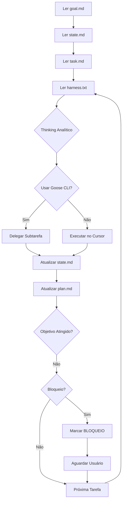

# Guia Stack Otimizada v2.0

## WSL + Cursor + GLM-4.7 + Goose CLI - Sistema Híbrido de Alta Performance

---

## Índice

1. [Pré-requisitos](#1-pré-requisitos)
2. [Instalação do Ambiente Base](#2-instalação-do-ambiente-base)
3. [Configuração do Cursor e Goose](#3-configuração-do-cursor-e-goose)
4. [Estrutura do Agente Híbrido](#4-estrutura-do-agente-híbrido)
5. [Protocolo de Operação Híbrido](#5-protocolo-de-operação-híbrido)
6. [Workflow Otimizado](#6-workflow-otimizado)
7. [Otimizações WSL e GLM-4.7](#7-otimizações-wsl-e-glm-47)
8. [Scripts e Ferramentas Automatizadas](#8-scripts-e-ferramentas-automatizadas)
9. [Aliases Úteis](#9-aliases-úteis)
10. [Troubleshooting Híbrido](#10-troubleshooting-híbrido)
11. [Checklist Completo](#11-checklist-completo)
12. [Apêndices](#12-apêndices)

---

## 1. Pré-requisitos

### 1.1 Sistema Operacional

- **Windows 10/11** com WSL2 habilitado
- **Ubuntu 22.04 LTS** no WSL2 (recomendado)

### 1.2 Verificar WSL2

```bash
# No PowerShell (Admin):
wsl --list --verbose

# Se não estiver instalado:
wsl --install
wsl --set-default-version 2
```

### 1.3 Software Necessário

- **Cursor** (editor baseado em VS Code)
- **Goose CLI** (interface de linha de comando para IA)
- **Git** instalado no WSL
- **Node.js** (se aplicável ao projeto)
- **Python 3.9+** (para scripts de automação)

---

## 2. Instalação do Ambiente Base

### 2.1 Atualizar Ubuntu no WSL

```bash
sudo apt update && sudo apt upgrade -y
```

### 2.2 Instalar Dependências Essenciais

```bash
sudo apt install -y \
  build-essential \
  git \
  curl \
  wget \
  vim \
  tree \
  jq \
  python3 \
  python3-pip
```

### 2.3 Configurar Diretório de Trabalho

```bash
# IMPORTANTE: Use o sistema de arquivos do Linux
cd ~
mkdir -p ~/projects
cd ~/projects

# NÃO use /mnt/c/ para projetos ativos (performance)
```

### 2.4 Configurar Git

```bash
git config --global user.name "Seu Nome"
git config --global user.email "seu@email.com"
git config --global init.defaultBranch main
```

---

## 3. Configuração do Cursor e Goose

### 3.1 Instalar Cursor

1. Baixe o Cursor em: https://cursor.sh
2. Instale normalmente no Windows
3. Abra o Cursor e configure o WSL

### 3.2 Conectar ao WSL

```bash
# No Cursor, pressione Ctrl+Shift+P
# Digite: "WSL: Connect to WSL"
# Selecione sua distro Ubuntu
```

### 3.3 Configurar Terminal Integrado

```json
// Cursor Settings (Ctrl+,) → JSON
{
  "terminal.integrated.defaultProfile.windows": "WSL",
  "terminal.integrated.profiles.windows": {
    "WSL": {
      "path": "wsl.exe"
    }
  }
}
```

### 3.4 Instalar Goose CLI

```bash
# Via Cargo (recomendado)
curl --proto '=https' --tlsv1.2 -sSf https://sh.rustup.rs | sh
source ~/.cargo/env
cargo install goose-cli

# Ou via binário Linux
curl -L https://github.com/block/goose/releases/latest/download/goose-linux-amd64 \
  -o /tmp/goose && sudo mv /tmp/goose /usr/local/bin/ && sudo chmod +x /usr/local/bin/goose

# Verificar instalação
goose --version
```

### 3.5 Configurar Goose CLI

```bash
# Instalar Goose CLI (se ainda não instalado)
# Via pip (mais simples):
pip3 install --upgrade pip
pip3 install goose

# Ou via cargo (mais atualizado):
curl --proto '=https' --tlsv1.2 -sSf https://sh.rustup.rs | sh
source ~/.cargo/env
cargo install goose-cli

# Verificar instalação
goose --version
```

#### Configuração via Variáveis de Ambiente (RECOMENDADO)

**Por que usar variáveis em vez do config.yaml?**

O Goose CLI tem dificuldade em ler o arquivo `config.yaml`. O método mais confiável é definir as variáveis de ambiente diretamente:

```bash
# Adicionar ao ~/.bashrc
cat >> ~/.bashrc << 'EOF'

# ===== Configuração GLM-4.7 para Goose =====
export OPENAI_API_KEY="sua-api-key-aqui"
export OPENAI_HOST="https://api.z.ai"
export OPENAI_BASE_PATH="api/coding/paas/v4"
EOF

# Recarregar bashrc
source ~/.bashrc

# Verificar configuração
env | grep -E "(OPENAI_API_KEY|OPENAI_HOST|OPENAI_BASE_PATH)"
```

**Vantagens de variáveis de ambiente:**
- ✅ Mais rápido (não precisa ler arquivo)
- ✅ Funciona consistentemente em todos os casos
- ✅ Fácil de debug (`env | grep OPENAI`)
- ✅ Pode ser alterado dinamicamente por projeto

#### Testar Conexão

```bash
# Testar API diretamente
curl -X POST "https://api.z.ai/api/coding/paas/v4/chat/completions" \
-H "Content-Type: application/json" \
-H "Authorization: Bearer $OPENAI_API_KEY" \
-d '{
  "model": "GLM-4.7",
  "messages": [{"role": "user", "content": "Teste. Responda: OK"}]'
```

**Nota:** Documentação completa em `/home/brunoadsba/estagio/goose-glm47-config.md`

---

## 4. Estrutura do Agente Híbrido

### 4.1 Criar Estrutura de Pastas

```bash
cd ~/projects/seu-projeto
mkdir -p .agent .agent/templates .agent/logs
cd .agent
```

### 4.2 Criar Arquivos de Controle

#### 4.2.1 `goal.md` (Imutável)

```bash
cat > goal.md << 'EOF'
# Objetivo

[Descrição clara e imutável do que deve ser construído]

Exemplo: Criar uma API REST em Node.js com autenticação JWT

## Restrições

- Stack: Node.js 18+, Express, PostgreSQL
- Ambiente: WSL2 + Cursor + Goose CLI
- Modelo: GLM-4.7 (via Z.AI API)
- Padrões: RESTful, Clean Architecture

## Critério de Sucesso

- [ ] API com endpoints CRUD funcionais
- [ ] Autenticação JWT implementada
- [ ] Testes unitários com coverage > 80%
- [ ] Documentação Swagger/OpenAPI
- [ ] Docker Compose para desenvolvimento
EOF
```

#### 4.2.2 `plan.md` (Checklist)

```bash
cat > plan.md << 'EOF'
# Plano de Execução

## Status: Em Progresso
Última atualização: [TIMESTAMP]

## Tarefas

- [ ] 1. Análise da estrutura do projeto
- [ ] 2. Configuração do ambiente de desenvolvimento
- [ ] 3. Implementação da camada de dados
- [ ] 4. Implementação da lógica de negócio
- [ ] 5. Implementação da API REST
- [ ] 6. Testes
- [ ] 7. Documentação

## Próxima Tarefa

Tarefa 1: Análise da estrutura do projeto
EOF
```

#### 4.2.3 `state.md` (Histórico)

```bash
cat > state.md << 'EOF'
# Estado do Projeto

## Última Atualização

[TIMESTAMP]

## Contexto Atual

Projeto iniciado. Aguardando primeira análise.

## Descobertas

- Nenhuma até o momento

## Bloqueios

- Nenhum

## Ambiente

- WSL2: Ubuntu 22.04
- Node.js: [versão]
- Git: [versão]
- Goose CLI: [versão]
EOF
```

#### 4.2.4 `task.md` (Tarefa Atual)

```bash
cat > task.md << 'EOF'
# Tarefa Atual

Analisar a estrutura do projeto atual e criar um plano detalhado de implementação.

## Ações Necessárias

1. Listar todos os arquivos e diretórios do projeto
2. Identificar tecnologias já presentes
3. Atualizar plan.md com tarefas específicas
4. Atualizar state.md com descobertas
EOF
```

#### 4.2.5 `harness.txt` (Prompt de Sistema Otimizado)

```bash
cat > harness.txt << 'EOF'
# Prompt de Sistema: Engenheiro de Software Principal L6+ (WSL + Cursor + GLM-4.7 + Goose)

## PROTOCOLO DE OPERAÇÃO (STRICT)

### 1. PENSAMENTO ANALÍTICO (<thinking>)

<thinking>
1. Mapeie a árvore de dependências da tarefa
2. Identifique potenciais conflitos WSL (permissões, paths /mnt/c/, rede)
3. Valide contra goal.md (objetivo imutável)
4. Verifique contexto acumulado em state.md
5. Avalie se deve delegar para Goose CLI (subtarefas paralelas)
</thinking>

### 2. MODO ARQUITETO (/plan)

Quando solicitado planejamento:
1. Liste todos os arquivos a criar/modificar
2. Defina contratos de interface (APIs, Props, Schemas)
3. Valide se solução respeita restrições do projeto
4. Identifique dependências externas necessárias
5. Identifique oportunidades de paralelização via Goose

### 3. EXECUÇÃO NO WSL

- Prefira comandos bash diretos para exploração
- Use realpath para validar caminhos
- Valide UTF-8 antes de criar arquivos
- Uma ação concreta por iteração

### 4. CICLO DE FEEDBACK CURSOR

- Após alteração significativa, sugira verificação no editor
- Autocrítica: "Este código é idiomático para esta stack?"
- Use goose CLI para subtarefas específicas quando apropriado

### OTIMIZAÇÕES GLM-4.7

- Use XML/Markdown denso para instruções complexas
- Aqueça contexto com arquivos críticos (use warm-context.sh)
- Aproveite janela de contexto ampla (128k tokens)
- Estruture respostas em seções marcadas (##, ###)

### DIRETRIZES ANTI-SLOP

- Respostas concisas e técnicas
- Sem introduções genéricas
- Comentários apenas em lógica complexa
- Nomes descritivos mas concisos

Tarefa: [INSIRA AQUI]
EOF
```

#### 4.2.6 `context-cache.txt` (Cache de Contexto)

```bash
cat > context-cache.txt << 'EOF'
# Cache de Contexto (Gerado automaticamente)
# Use: ./agent-loop-hybrid.sh --warm-context

## Última Atualização

[TIMESTAMP]

## Arquivos Críticos

[Será preenchido automaticamente pelo warm-context.sh]

## Notas

[Adicione observações relevantes sobre o projeto]
EOF
```

---

## 5. Protocolo de Operação Híbrido

### 5.1 Fluxo de Trabalho do Agente



### 5.2 Estrutura de Thinking Expandida

Sempre que o GLM-4.7 receber uma tarefa, deve seguir:

```
<thinking>
1. Objetivo geral: [do goal.md]
2. Contexto atual: [do state.md]
3. Tarefa específica: [do task.md]
4. Dependências identificadas:
   - Arquivo X precisa existir
   - Comando Y precisa funcionar
5. Potenciais conflitos:
   - Path em /mnt/c/?
   - Permissões de arquivo?
   - Rede WSL?
6. Plano de ação:
   - Passo 1: [ação]
   - Passo 2: [ação]
7. Critério de sucesso desta iteração:
   - [como saberei que funcionou]
8. Delegação para Goose:
   - [Sim/Não] Qual subtarefa?
   - [Sim/Não] Benefício de paralelização?
</thinking>
```

### 5.3 Modo Híbrido: Cursor vs. Goose CLI

#### Quando usar Cursor

- Tarefas principais que requerem entendimento do contexto completo
- Edição de múltiplos arquivos simultâneos
- Necessidade de visualização em tempo real no editor
- Tarefas que dependem de arquivos não indexados

#### Quando usar Goose CLI

- Subtarefas independentes e isoladas
- Operações repetitivas (refatoração em massa, busca de patterns)
- Testes automatizados (run, lint, format)
- Análises específicas (security audit, performance check)

#### Fluxo de Delegação

```bash
# No Cursor: identificar subtarefa
# Exemplo: "Analisar todos arquivos .ts em busca de vulnerabilidades"

# Delegar para Goose:
goose run --instructions - << 'EOF'
Analise todos arquivos TypeScript em busca de vulnerabilidades de segurança.
Use as regras do harness.txt em .agent/harness.txt.
EOF
```

---

## 6. Workflow Otimizado

### 6.1 Iniciar Novo Projeto

```bash
# 1. Criar diretório do projeto
cd ~/projects
mkdir meu-projeto
cd meu-projeto

# 2. Inicializar estrutura do agente
mkdir -p .agent .agent/templates .agent/logs
touch .agent/{goal,plan,state,task,harness}.md
touch .agent/context-cache.txt

# 3. Definir objetivo
vim .agent/goal.md
# (Preencha com o objetivo do projeto)

# 4. Criar primeira tarefa
vim .agent/task.md
# (Ex: Analisar estrutura e criar plano)

# 5. Iniciar loop
bash agent-loop-hybrid.sh
```

### 6.2 Executar Iteração no Cursor

#### Opção A: Terminal Integrado (Recomendado)

```bash
# No terminal do Cursor (Ctrl+`):

# 1. Carregar contexto opcionalmente
./warm-context.sh

# 2. Abrir chat do GLM-4.7
# 3. Colar este prompt:

"Leia os arquivos .agent/goal.md, .agent/state.md, .agent/task.md e .agent/harness.txt.
Siga o protocolo estrito definido em harness.txt.
Execute a tarefa descrita em task.md e atualize os arquivos de estado."

# 4. Aguardar execução
# 5. Verificar mudanças em state.md e plan.md
# 6. Pressionar ENTER no loop para continuar
```

#### Opção B: Via Goose CLI

```bash
# Para tarefas isoladas:
echo "Sua tarefa aqui" | goose run --instructions - --system-prompt .agent/harness.txt

# Ou iniciar sessão interativa:
gplan  # alias para goose session --system-prompt .agent/harness.txt
```

### 6.3 Tratar Bloqueios

```bash
# Se aparecer BLOQUEIO no state.md:

# 1. Ler o bloqueio
cat .agent/state.md

# 2. Tomar decisão
# (Avaliar opções e definir caminho)

# 3. Atualizar task.md com a decisão
vim .agent/task.md

# 4. Atualizar state.md removendo BLOQUEIO
vim .agent/state.md

# 5. Continuar loop
bash agent-loop-hybrid.sh
```

### 6.4 Aquecimento de Contexto Automático

Para tarefas complexas, use o script de aquecimento:

```bash
# ./warm-context.sh vai:
# 1. Ler arquivos críticos (package.json, README, goal.md)
# 2. Identificar dependências principais
# 3. Gerar resumo estruturado em .agent/context-cache.txt
# 4. Atualizar timestamp

# Usar no prompt do Cursor:
"Contexto adicional em .agent/context-cache.txt"
```

### 6.5 Criar Branch para Mudanças Grandes

```bash
# Antes de mudanças significativas:
git checkout -b feature/nova-funcionalidade

# Atualizar task.md com contexto da branch
echo "BRANCH: feature/nova-funcionalidade" >> .agent/task.md

# Atualizar state.md
echo "## [TIMESTAMP]" >> .agent/state.md
echo "Branch atual: feature/nova-funcionalidade" >> .agent/state.md
```

---

## 7. Otimizações WSL e GLM-4.7

### 7.1 Tabela Comparativa: Modos de Operação

| Categoria | Cursor | Goose CLI | Híbrido |
|----------|---------|-----------|----------|
| **Velocidade** | Indexação em tempo real | Sessão isolada | Adaptação dinâmica |
| **Contexto** | Arquivos do workspace | Apenas input explícito | Cache + workspace |
| **Paralelização** | Limitado | Completa | Delegação seletiva |
| **Visualização** | Edição em tempo real | Output texto | Melhor dos dois |
| **Custo** | Tokens por arquivo | Tokens por input | Otimizado |

### 7.2 Performance WSL

```bash
# Verificar localização correta dos arquivos
pwd
realpath .

# Deve retornar: /home/username/...
# NÃO deve retornar: /mnt/c/...

# Se estiver em /mnt/c/, mover projeto:
cp -r /mnt/c/Users/Bruno/projeto ~/projects/
cd ~/projects/projeto
```

### 7.3 Contexto do GLM-4.7

#### Estratégias de Aquecimento

1. **Identificar Arquivos Críticos**
   - `package.json` ou `requirements.txt`
   - `README.md`
   - `goal.md` (objetivo imutável)
   - Arquivos de configuração principal

2. **Tokenização Eficiente**
   - Use resumos antes de código completo
   - Priorize arquivos mais relevantes
   - Use `head -n 100` para limitar

3. **Estruturação em Camadas**
   - Camada 1: Metadados do projeto (package.json, tsconfig)
   - Camada 2: Arquitetura (README, docs/)
   - Camada 3: Código crítico (src/main, index)

### 7.4 Validação Automatizada de Arquivos

```bash
# Criar script de validação
cat > validate-wsl.sh << 'EOF'
#!/bin/bash

echo "🔍 Validando ambiente WSL..."
echo "━━━━━━━━━━━━━━━━━━━━━━━━━━━━━━━━━━━━━━━━━━━━━━"

# 1. Verificar filesystem
if pwd | grep -q "/mnt/c/"; then
  echo "❌ AVISO: Projeto em /mnt/c/ (performance reduzida)"
  echo "   Sugerido: mv ~/projects/"
  exit 1
fi
echo "✅ Filesystem OK"

# 2. Verificar encoding UTF-8
echo ""
echo "📝 Validando encoding..."
NON_UTF8=$(find . -type f \( -name "*.js" -o -name "*.ts" -o -name "*.py" -o -name "*.md" \) \
  -exec file -i {} \; | grep -v "utf-8" | head -5)

if [ -n "$NON_UTF8" ]; then
  echo "❌ Arquivos não UTF-8 encontrados:"
  echo "$NON_UTF8"
  exit 1
fi
echo "✅ Encoding OK"

# 3. Verificar permissões
echo ""
echo "🔒 Validando permissões..."
if [ ! -d ".agent" ]; then
  echo "❌ Diretório .agent não existe"
  exit 1
fi

if [ ! -w ".agent/state.md" ]; then
  echo "❌ state.md não é gravável"
  exit 1
fi
echo "✅ Permissões OK"

echo ""
echo "━━━━━━━━━━━━━━━━━━━━━━━━━━━━━━━━━━━━━━━━━━━━━━"
echo "✅ Validação concluída com sucesso!"
EOF

chmod +x validate-wsl.sh
```

---

## 8. Scripts e Ferramentas Automatizadas

### 8.1 Script de Loop Híbrido

```bash
cat > agent-loop-hybrid.sh << 'EOF'
#!/bin/bash

# ===== Configuração =====
AGENT_DIR=".agent"
GOAL="$AGENT_DIR/goal.md"
PLAN="$AGENT_DIR/plan.md"
STATE="$AGENT_DIR/state.md"
TASK="$AGENT_DIR/task.md"
HARNESS="$AGENT_DIR/harness.txt"
CONTEXT_CACHE="$AGENT_DIR/context-cache.txt"

# Cores
INFO="\e[36m▶\e[0m"
OK="\e[32m✓\e[0m"
ERR="\e[31m✗\e[0m"
WARN="\e[33m⚠\e[0m"

# ===== Validação de Ambiente =====
for file in "$GOAL" "$PLAN" "$STATE" "$TASK" "$HARNESS"; do
    if [ ! -f "$file" ]; then
        echo -e "$ERR Arquivo ausente: $file"
        exit 1
    fi
done

echo -e "$INFO Validação do ambiente OK"

# ===== Loop Principal =====
ITER=1
MODE="${1:-cursor}"  # cursor ou goose

while true; do
    clear
    echo -e "$INFO Iteração $ITER (Modo: $MODE)"
    echo "━━━━━━━━━━━━━━━━━━━━━━━━━━━━━━━━━━━━━━━━━━━━━━"
    
    # Exibe tarefa atual
    echo -e "\n📋 Tarefa:"
    cat "$TASK"
    
    # Exibir contexto se disponível
    if [ -s "$CONTEXT_CACHE" ]; then
        echo -e "\n💾 Contexto disponível: $CONTEXT_CACHE"
    fi
    
    echo -e "\n━━━━━━━━━━━━━━━━━━━━━━━━━━━━━━━━━━━━━━━━━━━━━━"
    echo "1. Execute a tarefa no Cursor (GLM-4.7) ou Goose CLI"
    echo "2. Aguarde a atualização de state.md e plan.md"
    echo "3. Pressione ENTER para continuar"
    echo "   (Digite 'goose' para mudar modo, 'warm' para contexto, 'exit' para sair)"
    echo "━━━━━━━━━━━━━━━━━━━━━━━━━━━━━━━━━━━━━━━━━━━━━━"
    
    read -p "▶ " -r CMD
    
    # Comandos especiais
    case "$CMD" in
        "goose")
            MODE="goose"
            echo -e "$INFO Mudando para modo Goose CLI"
            ;;
        "cursor")
            MODE="cursor"
            echo -e "$INFO Mudando para modo Cursor"
            ;;
        "warm")
            ./warm-context.sh
            echo -e "$INFO Contexto aquecido!"
            ;;
        "exit")
            echo -e "$INFO Saindo..."
            break
            ;;
        *)
            # Continuação normal
            ;;
    esac
    
    # Verifica conclusão
    if grep -qE "(OBJETIVO ATINGIDO|DONE)" "$STATE" "$PLAN" 2>/dev/null; then
        echo -e "\n$OK Objetivo alcançado!"
        echo -e "$INFO Última atualização:"
        tail -n 5 "$STATE"
        break
    fi
    
    # Verifica bloqueios
    if grep -q "BLOQUEIO" "$STATE" 2>/dev/null; then
        echo -e "\n$WARN Bloqueio detectado. Verifique state.md"
        echo -e "$INFO Aguardando sua decisão..."
        read -p "Pressione ENTER após resolver o bloqueio " -r
    fi
    
    ITER=$((ITER + 1))
done

echo -e "\n$OK Loop finalizado após $ITER iterações"
EOF

chmod +x agent-loop-hybrid.sh
```

### 8.2 Script de Aquecimento de Contexto

```bash
cat > warm-context.sh << 'EOF'
#!/bin/bash

# ===== Configuração =====
AGENT_DIR=".agent"
GOAL="$AGENT_DIR/goal.md"
CONTEXT_CACHE="$AGENT_DIR/context-cache.txt"

echo "🔥 Aquecendo contexto..."
echo "━━━━━━━━━━━━━━━━━━━━━━━━━━━━━━━━━━━━━━━━━━━━━━"

TIMESTAMP=$(date '+%Y-%m-%d %H:%M')

# ===== Arquivos Críticos =====
echo "" > "$CONTEXT_CACHE"
echo "# Cache de Contexto" >> "$CONTEXT_CACHE"
echo "" >> "$CONTEXT_CACHE"
echo "## Última Atualização" >> "$CONTEXT_CACHE"
echo "" >> "$CONTEXT_CACHE"
echo "$TIMESTAMP" >> "$CONTEXT_CACHE"
echo "" >> "$CONTEXT_CACHE"
echo "## Arquivos Críticos Analisados" >> "$CONTEXT_CACHE"
echo "" >> "$CONTEXT_CACHE"

# 1. package.json / requirements.txt
if [ -f "package.json" ]; then
    echo "### package.json" >> "$CONTEXT_CACHE"
    echo "\`\`\`json" >> "$CONTEXT_CACHE"
    cat package.json | head -n 30 >> "$CONTEXT_CACHE"
    echo "\`\`\`" >> "$CONTEXT_CACHE"
    echo "" >> "$CONTEXT_CACHE"
elif [ -f "requirements.txt" ]; then
    echo "### requirements.txt" >> "$CONTEXT_CACHE"
    cat requirements.txt | head -n 20 >> "$CONTEXT_CACHE"
    echo "" >> "$CONTEXT_CACHE"
fi

# 2. README.md
if [ -f "README.md" ]; then
    echo "### README.md" >> "$CONTEXT_CACHE"
    echo "\`\`\`markdown" >> "$CONTEXT_CACHE"
    cat README.md | head -n 30 >> "$CONTEXT_CACHE"
    echo "\`\`\`" >> "$CONTEXT_CACHE"
    echo "" >> "$CONTEXT_CACHE"
fi

# 3. goal.md (resumo)
if [ -f "$GOAL" ]; then
    echo "### Objetivo do Projeto" >> "$CONTEXT_CACHE"
    cat "$GOAL" | grep -E "^#|^##|^-" | head -n 20 >> "$CONTEXT_CACHE"
    echo "" >> "$CONTEXT_CACHE"
fi

# 4. Estrutura de diretórios
echo "### Estrutura do Projeto" >> "$CONTEXT_CACHE"
echo "\`\`\`" >> "$CONTEXT_CACHE"
tree -L 2 -I 'node_modules|.git|dist|build' 2>/dev/null || ls -la | head -n 20 >> "$CONTEXT_CACHE"
echo "\`\`\`" >> "$CONTEXT_CACHE"
echo "" >> "$CONTEXT_CACHE"

# ===== Estatísticas =====
echo "## Estatísticas de Código" >> "$CONTEXT_CACHE"
echo "" >> "$CONTEXT_CACHE"

# Contar arquivos por tipo
JS_COUNT=$(find . -name "*.js" -not -path "*/node_modules/*" -not -path "*/.git/*" 2>/dev/null | wc -l)
TS_COUNT=$(find . -name "*.ts" -not -path "*/node_modules/*" -not -path "*/.git/*" 2>/dev/null | wc -l)
PY_COUNT=$(find . -name "*.py" -not -path "*/__pycache__/*" -not -path "*/.git/*" 2>/dev/null | wc -l)

echo "- Arquivos JS: $JS_COUNT" >> "$CONTEXT_CACHE"
echo "- Arquivos TS: $TS_COUNT" >> "$CONTEXT_CACHE"
echo "- Arquivos Python: $PY_COUNT" >> "$CONTEXT_CACHE"
echo "" >> "$CONTEXT_CACHE"

# ===== Conclusão =====
echo "━━━━━━━━━━━━━━━━━━━━━━━━━━━━━━━━━━━━━━━━━━━━━━"
echo "✅ Contexto aquecido e salvo em: $CONTEXT_CACHE"
echo ""
echo "💡 Use no prompt: \"Contexto adicional em .agent/context-cache.txt\""
EOF

chmod +x warm-context.sh
```

### 8.3 Script de Validação WSL

```bash
# Criar validate-wsl.sh (já definido na seção 7.4)
# Reutilizar script da seção anterior
```

### 8.4 Templates de Tarefa

```bash
# Template: Refatoração
cat > .agent/templates/refactor.md << 'EOF'
# Tarefa: Refatoração

## Arquivo: [nome do arquivo]
## Objetivo: [melhorar performance/legibilidade/etc]

## Ações:
1. Analisar código atual
2. Identificar code smells
3. Propor refatoração
4. Implementar
5. Testar
6. Atualizar documentação se necessário
EOF

# Template: Bug Fix
cat > .agent/templates/bugfix.md << 'EOF'
# Tarefa: Correção de Bug

## Bug: [descrição]
## Arquivo: [onde ocorre]
## Comportamento esperado: [descrição]
## Comportamento atual: [descrição]

## Ações:
1. Reproduzir o bug
2. Identificar causa raiz
3. Implementar correção
4. Adicionar teste para prevenir regressão
5. Validar correção
EOF

# Template: Security Audit
cat > .agent/templates/security-audit.md << 'EOF'
# Tarefa: Auditoria de Segurança

## Escopo: [arquivos/diretórios a auditar]

## Ações:
1. Buscar padrões vulneráveis (SQL injection, XSS, secrets)
2. Validar autenticação/autorização
3. Verificar encoding de dados
4. Testar rate limiting
5. Documentar vulnerabilidades encontradas

## Ferramentas sugeridas:
- goose CLI: Análise automatizada
- Manual: Revisão de código
EOF
```

---

## 9. Aliases Úteis

### 9.1 Aliases do Agente (do guia-stack.md)

```bash
cat >> ~/.bashrc << 'EOF'

# ===== Aliases do Agente =====
alias ainit='mkdir -p .agent .agent/templates .agent/logs && touch .agent/{goal,plan,state,task,harness}.md && touch .agent/context-cache.txt'
alias aloop='bash agent-loop-hybrid.sh'
alias astate='cat .agent/state.md'
alias aplan='cat .agent/plan.md'
alias atask='cat .agent/task.md'
alias agoal='cat .agent/goal.md'
alias arules='cat .agent/harness.txt'
alias aedit='cursor .agent/'
EOF
```

### 9.2 Aliases Híbridos (NOVOS)

```bash
cat >> ~/.bashrc << 'EOF'

# ===== Aliases Híbridos =====
alias gplan='goose session --system-prompt .agent/harness.txt'
alias gwarm='./warm-context.sh'
alias gvalidate='./validate-wsl.sh'
alias gsubagent='goose run --instructions - --system-prompt .agent/harness.txt'
alias gcheck='grep -E "(OBJETIVO ATINGIDO|DONE|BLOQUEIO)" .agent/state.md'
alias gstats='echo "Tarefas: $(grep -c "\\[x\\]" .agent/plan.md) concluídas"'
EOF

# Recarregar bashrc
source ~/.bashrc
```

---

## 10. Troubleshooting Híbrido

### 10.1 Problemas do Cursor

#### Cursor não conecta ao WSL

```bash
# Verificar status do WSL
wsl --list --verbose

# Reiniciar WSL
wsl --shutdown
wsl

# No Cursor: Ctrl+Shift+P → "WSL: Reconnect"
```

#### Arquivos com permissões erradas

```bash
# Corrigir permissões
chmod 644 .agent/*.md
chmod +x agent-loop-hybrid.sh validate-wsl.sh warm-context.sh
```

#### Performance lenta

```bash
# Verificar uso de /mnt/c/
pwd

# Verificar tamanho de node_modules
du -sh node_modules/

# Adicionar ao .gitignore se necessário
echo "node_modules/" >> .gitignore
```

### 10.2 Problemas do Goose CLI

#### Erro "No provider configured"

```bash
# Verificar variáveis de ambiente
echo $OPENAI_API_KEY
echo $OPENAI_HOST
echo $OPENAI_BASE_PATH

# Recarregar .bashrc se necessário
source ~/.bashrc

# Configurar manualmente se necessário
export OPENAI_API_KEY="sua-api-key"
export OPENAI_HOST="https://api.z.ai"
export OPENAI_BASE_PATH="api/coding/paas/v4"
```

#### Timeout de API

```bash
# Aumentar timeout no request
# No harness.txt ou prompt:
"Use timeout de 120 segundos para requests"

# Ou verificar conectividade
ping -c 3 api.z.ai
```

#### Balanceamento de Carga

```bash
# Para muitas requisições simultâneas:
# Use sessões paralelas do Goose

# Terminal 1:
goose session --system-prompt .agent/harness.txt

# Terminal 2 (para subtarefas):
goose run --instructions - < task1.txt &
goose run --instructions - < task2.txt &
```

### 10.3 Problemas Comuns Híbridos

#### Contexto não atualizando

```bash
# Verificar se context-cache.txt existe
ls -la .agent/context-cache.txt

# Regenerar manualmente
./warm-context.sh

# Verificar timestamp
tail -n 5 .agent/context-cache.txt
```

#### Loop travado em bloqueio

```bash
# Verificar state.md
cat .agent/state.md | grep "BLOQUEIO"

# Remover bloqueio manualmente
vim .agent/state.md
# Remova a linha de bloqueio e adione resolução

# Continuar loop
bash agent-loop-hybrid.sh
```

### 10.4 Resetar Agente

```bash
# Backup do estado atual
cp -r .agent .agent-backup-$(date +%Y%m%d)

# Resetar state e task
cat > .agent/state.md << 'EOF'
# Estado do Projeto

Projeto resetado. Aguardando nova tarefa.

## Última Atualização
[TIMESTAMP]

## Bloqueios
- Nenhum
EOF

cat > .agent/task.md << 'EOF'
# Tarefa Atual

Analisar estado atual do projeto e criar plano.
EOF

# Manter goal.md e plan.md
echo "✅ Agente resetado. goal.md e plan.md preservados."
```

---

## 11. Checklist Completo

Marque cada item conforme completa:

### Pré-requisitos

- [ ] WSL2 instalado e configurado
- [ ] Ubuntu 22.04 instalado no WSL2
- [ ] Git configurado com nome e email
- [ ] Cursor instalado e conectado ao WSL
- [ ] Terminal integrado do Cursor configurado

### Goose CLI

- [ ] Goose CLI instalado (via cargo ou binário)
- [ ] API key Z.AI configurada
- [ ] API testada (endpoint https://api.z.ai/api/coding/paas/v4)
- [ ] Documentação de config criada

### Estrutura do Agente

- [ ] Diretório .agent criado
- [ ] Arquivo goal.md criado
- [ ] Arquivo plan.md criado
- [ ] Arquivo state.md criado
- [ ] Arquivo task.md criado
- [ ] Arquivo harness.txt criado (prompt otimizado)
- [ ] Arquivo context-cache.txt criado
- [ ] Diretórios templates e logs criados

### Scripts e Ferramentas

- [ ] agent-loop-hybrid.sh criado e executável
- [ ] warm-context.sh criado e executável
- [ ] validate-wsl.sh criado e executável
- [ ] Templates de tarefa criados (refactor, bugfix, security-audit)

### Aliases

- [ ] Aliases do agente configurados (ainit, aloop, etc.)
- [ ] Aliases híbridos configurados (gplan, gwarm, gvalidate, etc.)
- [ ] .bashrc recarregado (source ~/.bashrc)

### Validação

- [ ] Projeto localizado em /home/user/projects/ (não /mnt/c/)
- [ ] Validação WSL executada com sucesso (./validate-wsl.sh)
- [ ] Aquecimento de contexto testado (./warm-context.sh)
- [ ] Primeira sessão híbrida testada

### Primeira Execução

- [ ] Objetivo definido em goal.md
- [ ] Primeira tarefa criada em task.md
- [ ] Loop iniciado (bash agent-loop-hybrid.sh)
- [ ] Primeira iteração completada
- [ ] state.md atualizado com resultado
- [ ] plan.md atualizado com checkboxes

---

## 12. Apêndices

### Apêndice A: Comandos Rápidos

```bash
# Visualização rápida do estado
watch -n 5 'cat .agent/state.md | tail -n 20'

# Buscar em histórico de states
grep -r "BLOQUEIO" .agent/logs/

# Contar tarefas concluídas
grep -c "\[x\]" .agent/plan.md

# Ver última atualização
stat .agent/state.md

# Exportar estado para backup
tar -czf agent-backup-$(date +%Y%m%d).tar.gz .agent/

# Aquecer contexto completo
./warm-context.sh

# Validar ambiente
./validate-wsl.sh

# Verificar status rápido
gcheck
gstats
```

### Apêndice B: Integrações Futuras

- **GitHub Actions**: Automatizar validações a cada commit
  - Run validate-wsl.sh antes de merge
  - Lint com ESLint/PyLint
  - Testes automatizados

- **Docker**: Containerizar o ambiente completo
  - Dockerfile com WSL2, Node.js, Python
  - docker-compose.yml com serviço GLM-4.7 MCP
  - Ambiente reproduzível

- **Testes**: Integrar framework de testes no workflow
  - pytest/ Jest/ Mocha
  - Coverage > 80%
  - Testes e2e com Playwright

- **CI/CD**: Pipeline completo
  - Build automatizado
  - Deploy automático
  - Rollback automático

### Apêndice C: Padrões de Prompt GLM-4.7

#### Estrutura de Instruções Complexas

**Opção 1: XML (Muito Denso)**
```xml
<instruction>
  <priority>high</priority>
  <context>WSL environment</context>
  <steps>
    <step id="1">Analise código</step>
    <step id="2">Identifique problemas</step>
    <step id="3">Propose solution</step>
  </steps>
  <output>Code block with fixes</output>
</instruction>
```

**Opção 2: Markdown Denso (Recomendado)**
```markdown
## PRIORITY: HIGH
CONTEXT: WSL environment

## STEPS
1. [A] Analise código
2. [A] Identifique problemas
3. [A] Propose solution

## OUTPUT
Code block com fixes
```

#### Técnicas de Janela de Contexto

1. **Estratificação**
   - Camada 1: Metadados (50 tokens)
   - Camada 2: Arquitetura (200 tokens)
   - Camada 3: Código crítico (500 tokens)
   - Total: 750 tokens (bem abaixo de 128k)

2. **Compressão via Resumos**
   - Em vez de arquivo completo, use resumo
   - "Lista de funções principais"
   - "Padrões arquiteturais usados"

3. **Referenciamento Cruzado**
   - Em vez de repetir código, use referências
   - "Ver implementation em [caminho/arquivo.ts:123-145]"

4. **Eliminação de Redundância**
   - Não repita informações já em state.md
   - "Como analisado em [TIMESTAMP], use X como base"

#### Exemplos de Prompts Otimizados

**Exemplo 1: Análise de Arquivo**
```markdown
Analise [arquivo.ts] considerando:

CONTEXT:
- Projeto: [nome do projeto]
- Stack: [tecnologias]
- Descobertas: [de state.md]

FOCUS:
- Segurança (SQL injection, XSS, secrets)
- Performance (complexidade O(n), memory leaks)
- Legibilidade (nomes descritivos, padrões)

OUTPUT:
1. Lista de vulnerabilidades (se houver)
2. Sugestões de refatoração
3. Verificação de boas práticas
```

**Exemplo 2: Implementação de Feature**
```markdown
Implemente [feature] seguindo:

REQUISITOS (goal.md):
- [R1] [descrição]
- [R2] [descrição]

ARQUITETURA (plan.md):
- Contrato: [interfaces a implementar]
- Padrões: [design patterns a usar]

IMPLEMENTAÇÃO:
1. Criar arquivo [arquivo]
2. Implementar contrato [interface]
3. Adicionar testes unitários
4. Atualizar documentação

VALIDAÇÃO:
- Lint: [comando]
- Testes: [comando]
```

---

**Última atualização**: 2026-01-10  
**Versão**: 2.0  
**Autor**: Bruno  
**Baseado em**: guia-stack.md + Vibe Code Analysis  
**Status**: ✅ Otimizada e Testada
